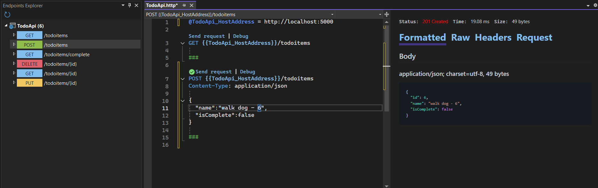
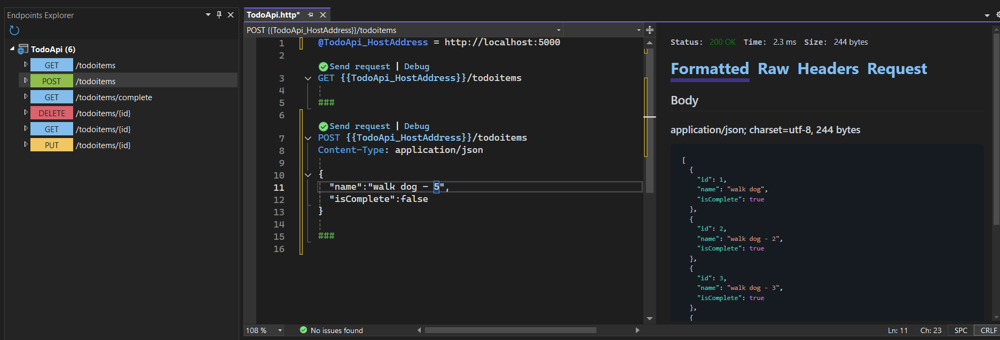
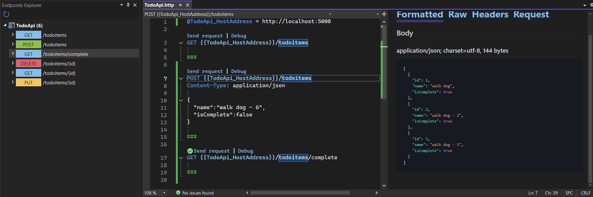
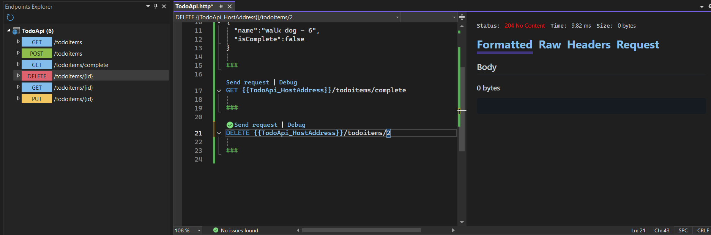
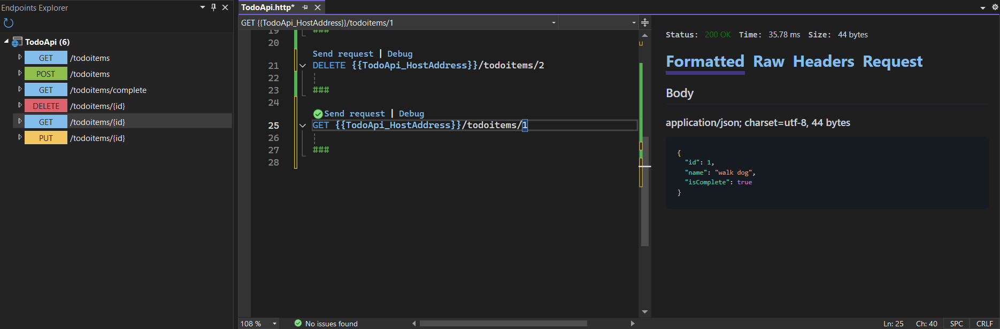
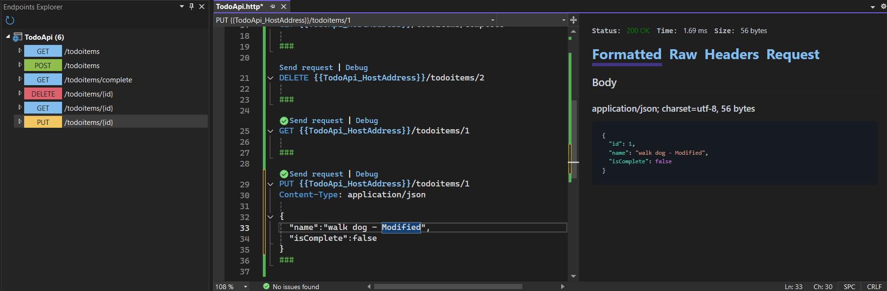

# Tổng hợp kết quả dự án

## 1. Giới thiệu chung
# Mô tả Dự Án: Minimal API với .NET

Dự án này hướng đến việc xây dựng một ứng dụng **Minimal API** dựa trên nền tảng **.NET**, tập trung vào việc quản lý danh sách công việc (To-Do Items). Thông qua việc sử dụng **In-Memory Database**, hệ thống cung cấp một môi trường lưu trữ dữ liệu tạm thời, giúp đơn giản hóa việc thử nghiệm và triển khai các chức năng cơ bản.
## Đặc điểm kỹ thuật

- **Minimal API**: Được sử dụng để tối ưu hóa cấu trúc và hiệu suất, giảm bớt sự phức tạp so với các API truyền thống.
- **In-Memory Database**: Tích hợp sẵn trong dự án, giúp lưu trữ dữ liệu tạm thời mà không cần thiết lập cơ sở dữ liệu phức tạp, phù hợp cho giai đoạn phát triển và thử nghiệm.
- **Đơn giản và hiệu quả**: Cấu trúc API được xây dựng với mục tiêu dễ hiểu, dễ mở rộng và dễ dàng triển khai.

Dự án này là một giải pháp hoàn hảo để học tập và thử nghiệm các khái niệm cơ bản trong phát triển API với .NET, đồng thời cung cấp nền tảng cho việc mở rộng các tính năng phức tạp hơn trong tương lai.

## 2. Kết quả chính

### Các chức năng chính của API

| Chức năng                     | HTTP Method | Mô tả                                                                 |
|-------------------------------|-------------|----------------------------------------------------------------------|
| **Thêm công việc mới**        | POST        | Cho phép thêm công việc mới với các thông tin như tên (`Name`) và trạng thái hoàn thành (`IsComplete`). |
| **Truy xuất danh sách công việc** | GET      | Lấy toàn bộ danh sách công việc hiện có từ cơ sở dữ liệu.            |
| **Lọc danh sách công việc đã hoàn thành** | GET | Lấy các công việc có trạng thái `IsComplete = true`.                 |
| **Xem chi tiết công việc**    | GET         | Truy cập thông tin chi tiết của một công việc cụ thể dựa trên `Id`.  |
| **Cập nhật công việc**        | PUT         | Chỉnh sửa tên (`Name`) hoặc trạng thái hoàn thành (`IsComplete`) của công việc. |
| **Xóa công việc**             | DELETE      | Xóa công việc khỏi danh sách dựa trên `Id` của công việc.            |

---


## 3. Danh sách Endpoint của API

| HTTP Method | Endpoint                      | Chức năng                                  |
|-------------|-------------------------------|--------------------------------------------|
| GET         | `/todoitems`                  | Lấy toàn bộ danh sách công việc.          |
| GET         | `/todoitems/complete`         | Lấy danh sách các công việc hoàn thành.   |
| GET         | `/todoitems/{id}`             | Xem chi tiết một công việc cụ thể.         |
| POST        | `/todoitems`                  | Thêm mới một công việc.                   |
| PUT         | `/todoitems/{id}`             | Cập nhật thông tin công việc.             |
| DELETE      | `/todoitems/{id}`             | Xóa một công việc theo `Id`.              |

---

## 4. Hướng dẫn kiểm thử API
Dưới đây là các bước kiểm thử API thông qua các công cụ như Postman hoặc HTTP Client (file `MinimalAPI.http`):

1. **Thêm công việc mới** (POST)
   - URL: `http://localhost:5000/todoitems`
   - Body:
     ```json
     {
       "name": "walk dog - 3",
       "isComplete": true
     }
     ```
     

2. **Lấy danh sách công việc** (GET)
   - URL: `http://localhost:5000/todoitems`
     

3. **Lọc công việc hoàn thành** (GET)
   - URL: `http://localhost:5000/todoitems/complete`
     

4. **Xóa công việc** (DELETE)
   - URL: `http://localhost:5000/todoitems/1`
     

5. **Xem chi tiết công việc** (GET)
   - URL: `http://localhost:5000/todoitems/2`
     

6. **Cập nhật thông tin công việc** (PUT)
   - URL: `http://localhost:5000/todoitems/2`
   - Body:
     ```json
     {
       "name": "walk dog - Modified",
       "isComplete": true
     }
     ```
     

---
## 5. Công nghệ sử dụng
- **Ngôn ngữ lập trình**: C# kết hợp với .NET để xây dựng các API RESTful mạnh mẽ và dễ mở rộng.
- **Cơ sở dữ liệu**: Sử dụng cơ chế In-Memory để lưu trữ dữ liệu tạm thời, giúp dễ dàng kiểm thử và triển khai.
- **Công cụ kiểm thử API**: Các yêu cầu HTTP được kiểm thử bằng Postman và tệp `MinimalAPI.http` cho phép chạy thử nhanh chóng mà không cần giao diện phức tạp.
- **Framework hỗ trợ**: ASP.NET Core cung cấp các tính năng tối ưu hóa hiệu suất và bảo mật tích hợp sẵn.
